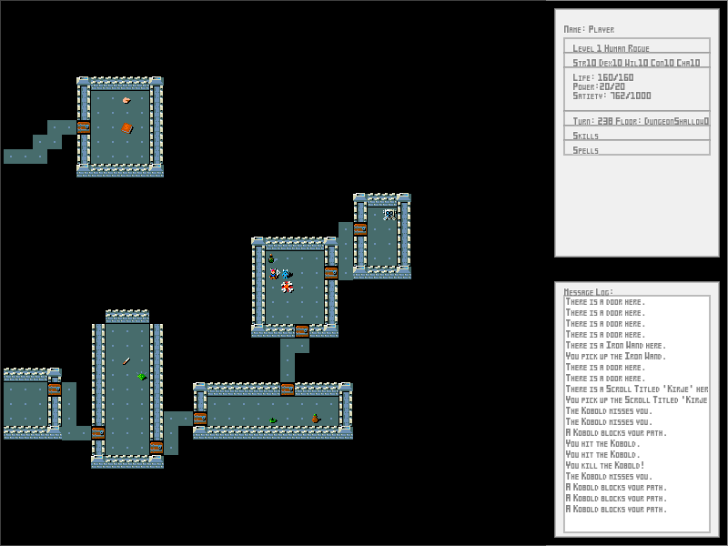

RoguelikeGame
=============

This is a simple Roguelike game implemented in JavaScript.  To see it in action, clone it with the --recursive option to include submodules, then open the file _RoguelikeGame.html in a web browser that runs JavaScript.  When running from the local filesystem, rather than from a web server, it may be necessary to change the security settings on the web browser to allow this.  On Google Chrome, for example, the browser can be started with the command-line option "--allow-file-access-from-files".

Use the arrow keys to move, the "g" key to pick things up, and the "a" key to attack.  Press the Tab key to see the inventory and the Escape key to see the settings screen.

 
